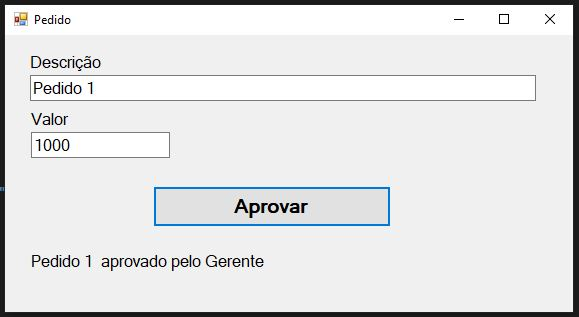
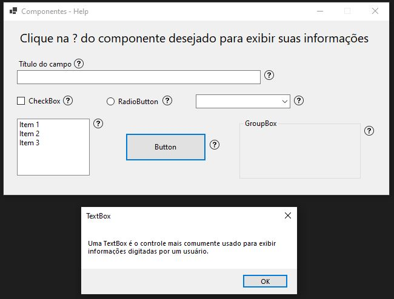
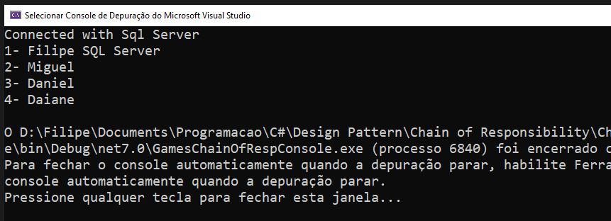
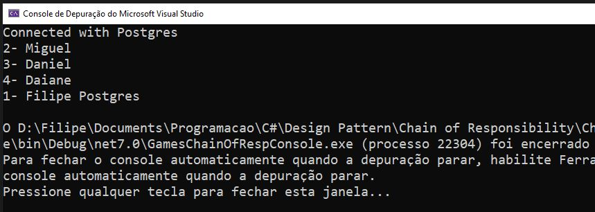

# Chain of Responsibility
É um padrão de projeto comportamental que permite que você passe pedidos por uma corrente de handlers. 
Ao receber um pedido, cada handler decide se processa o pedido ou o passa adiante para o próximo handler na corrente.

## Objetivo
Este conjunto de soluções tem por objetivo testar, entender e realizar alguns dos meus estudos em design pattern 
utilizando o livro <b>Design Pattern</b> do <b>GOF</b>. 

Durante várias semanas estive com meus colegas [Charles Path](https://www.linkedin.com/in/cpath/) 
e [Michel Guedes]( https://www.linkedin.com/in/michel-guedes-87793051/) onde fizemos várias calls analisando, 
discutindo, testando e lendo sobre este e vários outros patterns e demais assuntos sobre tecnologia.

Abaixo breve descrição das soluções contidas neste projeto.

## AprovaPedidoChainOfRespWF
Neste projeto temos uma simples simulação de um recurso de aprovação de pedidos. 
Ao inserir uma descrição, um valor e clicar no botão <b>Aprovar</b>, é realizado uma validação em decorrencia 
do valor informado. 
A validação é feita passando pelos métodos de aprovação inseridos dentro da cadeia de responsabilidade e a regra estabelecida é a seguinte: 
* Valor até 500 é aprovado pelo Coordenador;
* Valor até 5000 é provado pelo Gerente;
* Valor até 50000 é aprovado pela Presidência;
* Valor acima de 50000 não é aprovado.

<table border="0" align="center">
    <tr>
        <td>
            
        </td>
    </tr>
</table>

## HelpChainOfRespWF
Neste projeto temos uma tentativa de reprodução do exemplo dado no livro do <b>GOF</b> na página 212 do qual descreve um
exemplo da utilização deste pattern para a construção de uma solução de Help em uma aplicação. 
Assim, neste projeto criado em Windows Form, temos vários componentes seguidos de uma imagem com um ponto de interrogação (?). 
Ao clicar em algum destes, é exibido em uma MessageBox as informações referentes ao componente associado. 
Isso se deve a cadeia de responsabilidade atrelada a rotina da qual busca qual método irá atender a solicitação da exibição das informações.

<table border="0" align="center">
    <tr>
        <td>
            
        </td>
    </tr>
</table>

## GamesChainOfRespConsole
Neste projeto, realizado em C# console, temos uma rotina para trazer uma lista de jogadores. 
Para obter estes dados, é necessário realizar conexão em banco de dados. 
Assim a rotina estabelecida neste projeto, através deste pattern, executa tentativas de conexões em três bancos de dados, Sql Server,
Postgress e um arquivo SqlLite. Estando estas conexões dentro da cadeia de responsabilidades, a requisição é passada entre elas até
que uma delas atenda a requisição caso algum banco de dados venha a falhar fazendo assim a realização de uma espécie de load balance.

<table border="0" align="center">
    <tr>
        <td>
            
        </td>
    </tr>
    <tr>
        <td>
            
        </td>
    </tr>
</table>